<div align="center">

# ANANTHAM

### AI-based virtual camera tracking for coarse alignment of mobile FSOC terminals

Smart India Hackathon 2026 · **SIH26169** · ISRO / Space Applications Centre

[](https://github.com/karthikeyavelivela/anantham/actions/workflows/ci.yml)


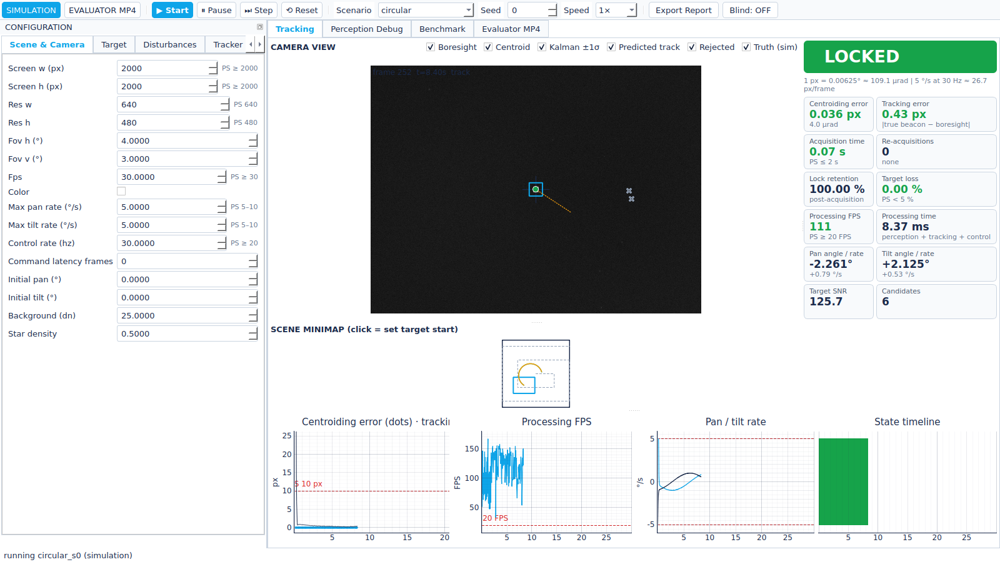

</div>

---

## Contents

1. [What ANANTHAM does](#what-anantham-does)
2. [Quick start](#quick-start)
3. [A tour of the console](#a-tour-of-the-console)
4. [How it works](#how-it-works)
5. [Problem-statement coverage](#problem-statement-coverage)
6. [Measured results](#measured-results)
7. [What every run writes](#what-every-run-writes)
8. [Repository layout and development](#repository-layout-and-development)
9. [Documentation](#documentation)

---

## What ANANTHAM does

Anantham is a software laboratory for the coarse stage of Pointing, Acquisition and
Tracking (PAT) in mobile FSOC links. It generates a configurable virtual scene with one or
more moving optical beacons, renders the view of a rate-limited virtual pan-tilt camera,
injects realistic disturbances (atmospheric turbulence, haze, fog, rain, low light,
salt & pepper / Gaussian / Poisson noise, camera jitter, platform vibration), and runs a
closed loop: **PERCEIVE → VALIDATE → PREDICT → CONTROL → RECOVER**. It detects and
identifies the designated beacon, estimates its position and velocity, keeps it centred
within actuator limits, recovers after loss, and logs every performance metric the PS
requires. In **Evaluator MP4** mode it bypasses the PTZ camera and runs the same perception
and tracking stack on external video.

Three design rules run through the whole code base:

| rule | what it means in practice |
|---|---|
| **Sensor boundary** | Perception, tracking and control see *only* the image and the camera's own commanded pan/tilt. Ground truth lives in `sim/` and `metrics/` only — `tests/test_boundary.py` fails if that is ever violated. |
| **No fabricated numbers** | Every number in the GUI, logs, reports and this README comes from an actual run; tables below are inserted by `tools/insert_results.py`. Failing cases are reported, not tuned away. |
| **Reproducible** | Every run is seeded; config + seed are saved next to its logs; the same seed gives bit-identical frames and CSV (tested). |

## Quick start

**Windows (no Python needed).** Download
[`ANANTHAM-windows.zip`](https://github.com/karthikeyavelivela/anantham/actions/runs/36458602000/artifacts/10986039020)
(162 MB, from [CI run #14](https://github.com/karthikeyavelivela/anantham/actions/runs/36458602000);
GitHub keeps artifacts until 27 Dec 2026 — newer builds appear under
[Actions](https://github.com/karthikeyavelivela/anantham/actions/workflows/ci.yml)), unzip, and
double-click `ANANTHAM\ANANTHAM.exe`. The same `.exe` accepts every CLI command below.
Downloading an artifact requires being signed in to GitHub.

**From source (Windows / Linux / macOS, Python ≥ 3.11).**

```bash
git clone https://github.com/karthikeyavelivela/anantham.git && cd anantham
pip install -r requirements.txt && pip install -e .
anantham gui
```

**Command line.**

```bash
anantham run   --preset circular --seed 3 --duration 20 --out results/        # one simulation → CSV, JSON, PDF
anantham run   --preset fog --acq wide_fov --start random --out results/      # optional wide-FOV acquisition
anantham make-video --preset fog --out test.mp4                               # synthetic MP4 + truth CSV
anantham video --input test.mp4 --truth test_truth.csv --out results/        # Evaluator MP4 mode
anantham bench --scenarios all --seeds 5 --acq both --start both --ablation   # full benchmark + ablation
```

Any parameter can be overridden, e.g. `--set target.size_px=15 --set disturbances.jitter_px=10`.
Values outside the PS ranges are refused unless `--allow-out-of-spec` is given.

## A tour of the console

The console (`anantham gui`) has a configuration dock on the left, the camera view with a
scene minimap in the middle, telemetry cards on the right and scrolling 30 s plots at the
bottom. All screenshots below are real runs, regenerated with
`tools/make_screenshots.py`.

### 1 · Tracking — the beacon is LOCKED


* **Camera view** — boresight cross, measured centroid (cyan box), Kalman prediction with
  its 1σ ellipse and predicted track (orange), rejected candidates (grey ×) and, in
  simulation only, the true position (green dot). Each overlay can be toggled.
* **Minimap** — the whole 2000×2000 px screen, the camera FOV (cyan), the search path and
  the true / estimated target trails. Click it to set a user-defined start position.
* **Telemetry** — state, centroiding error in px and µrad, tracking error, acquisition time,
  re-acquisitions, lock retention, target loss, processing FPS and ms, pan/tilt angle and
  rate, SNR and candidate count; green/red against the PS thresholds. The px ↔ angle line
  (1 px = 0.00625° ≈ 109.1 µrad; 5 °/s at 30 Hz ≈ 26.7 px/frame) is always shown.
* **Plots** — centroiding (dots) and tracking error (line) with the 10 px PS line,
  processing FPS with the 20 FPS line, pan/tilt rates with the slew limits, state timeline.

### 2 · Acquisition — searching the screen

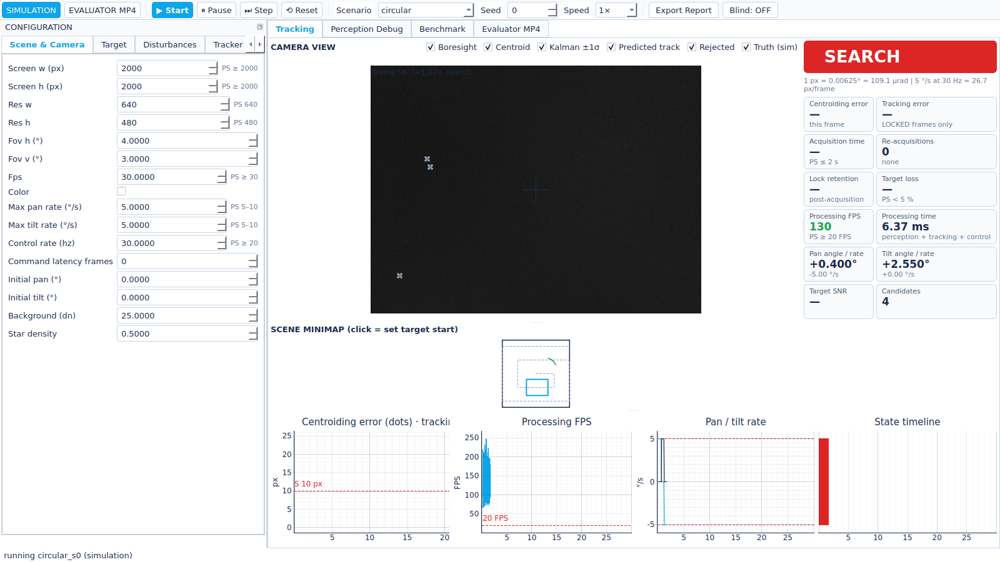

With a random start the beacon is usually outside the 4°×3° FOV. The camera runs a square
spiral from the screen centre (dashed path on the minimap) at the slew limit; a track may
only start from a compact, correctly sized, non-edge blob, and it must be confirmed in three
consecutive frames before the state turns LOCKED.

### 3 · Everything combined — disturbances tab

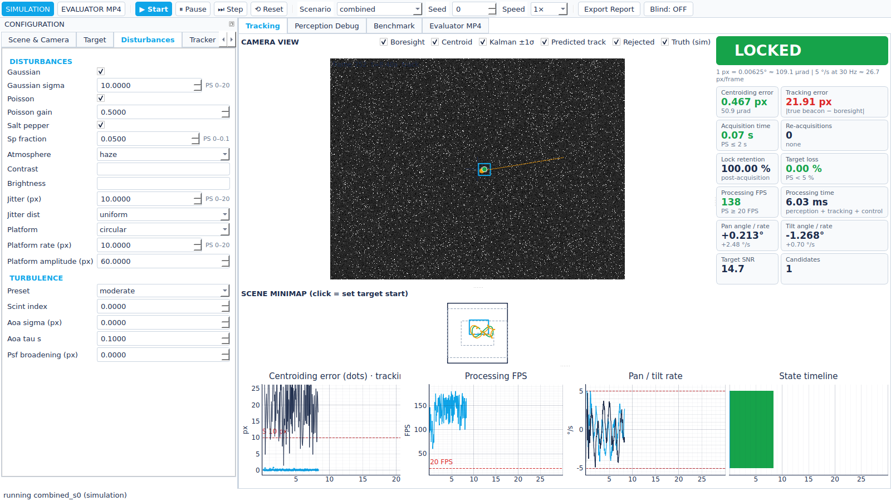

The **Disturbances** tab exposes every noise, atmosphere, turbulence, jitter and platform
parameter with its PS range (`PS 0–20`); out-of-range values turn red. Here Gaussian,
Poisson and salt & pepper noise, haze, moderate turbulence, ±10 px/frame jitter, circular
platform motion and a distractor beacon are all active at once. The tracking-error card is
red because jitter is a real line-of-sight error that no controller can cancel — see the
[failure analysis](docs/TECHNICAL_REPORT.md#12-failure-analysis).

### 4 · Identity — blink code against a same-size distractor

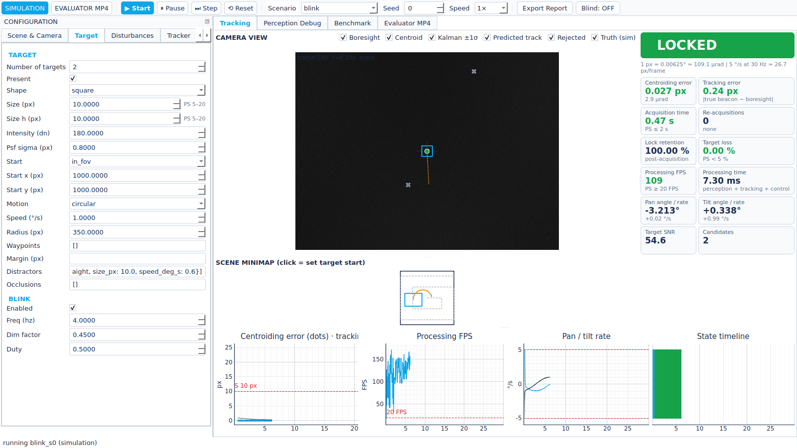

A same-size distractor cannot be rejected by its signature. With the blink code enabled
(**Target** tab), the designated beacon dims at 4 Hz; each tentative track's intensity is
tested over ≤ 0.5 s and only the beacon carrying the code is locked (acquisition 0.47 s here).

### 5 · Perception debug

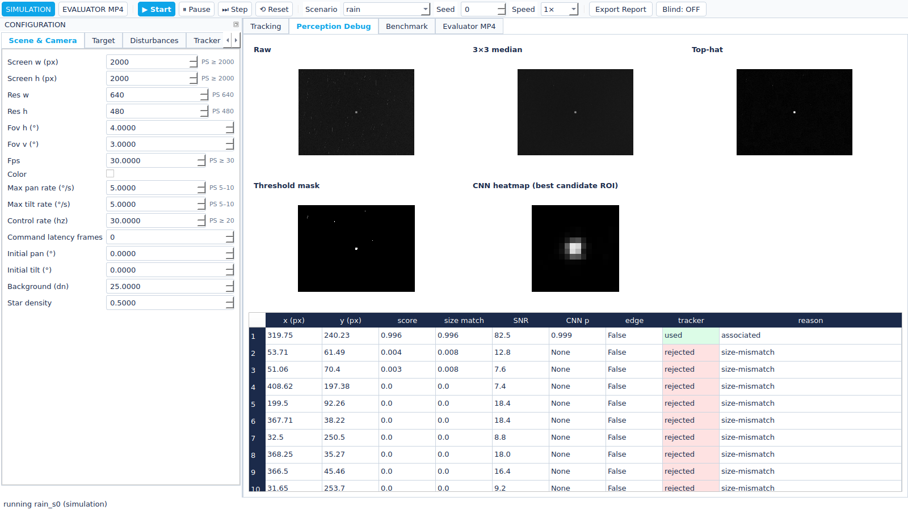

Every stage of the classical detector — raw, 3×3 median, top-hat, threshold mask — plus the
CNN heatmap of the best candidate and a table of all candidates with score, size match,
SNR, CNN probability and why the tracker used or rejected each one (here: rain streaks and
stars rejected by size mismatch).

### 6 · Evaluator MP4 mode — bypass the PTZ camera

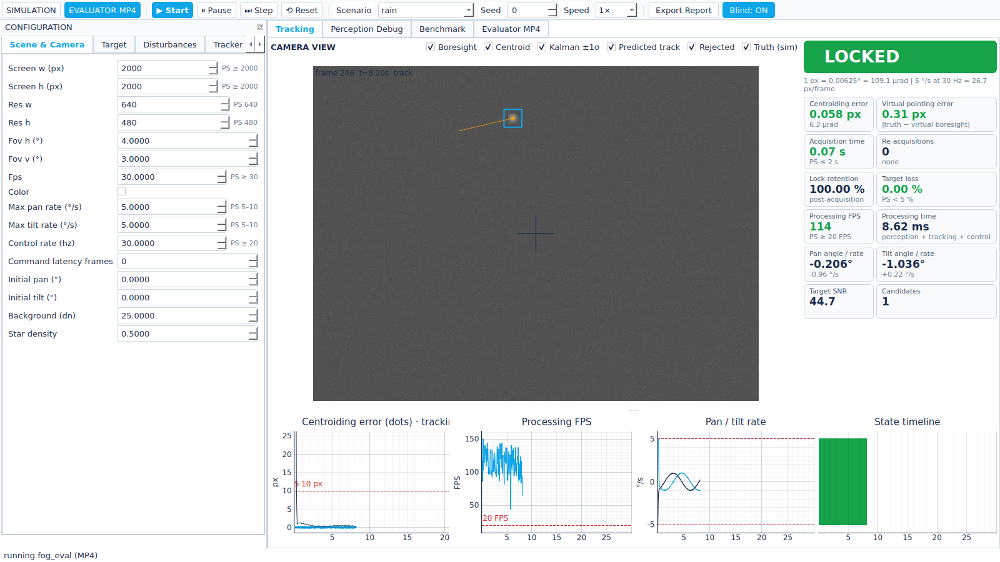

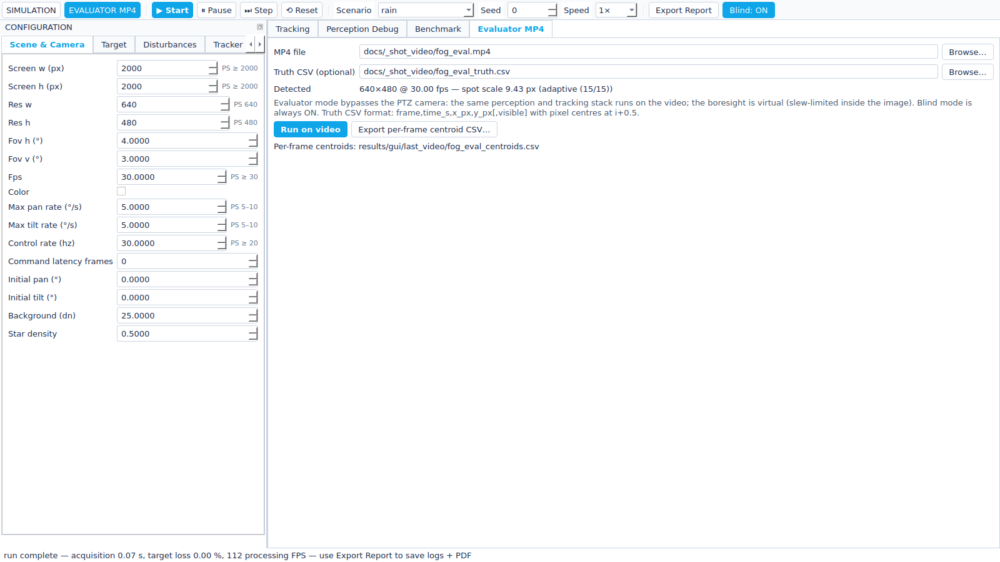

Load any MP4 (any resolution / frame rate), optionally with a truth CSV
(`frame,time_s,x_px,y_px[,visible]`). The spot size is estimated automatically from the
first frames, the boresight becomes virtual (slew-limited inside the image), blind mode is
forced on, and a per-frame centroid CSV (`frame,time_s,x_px,y_px,state,confidence`) is
written when the run ends.

### 7 · Benchmark tab

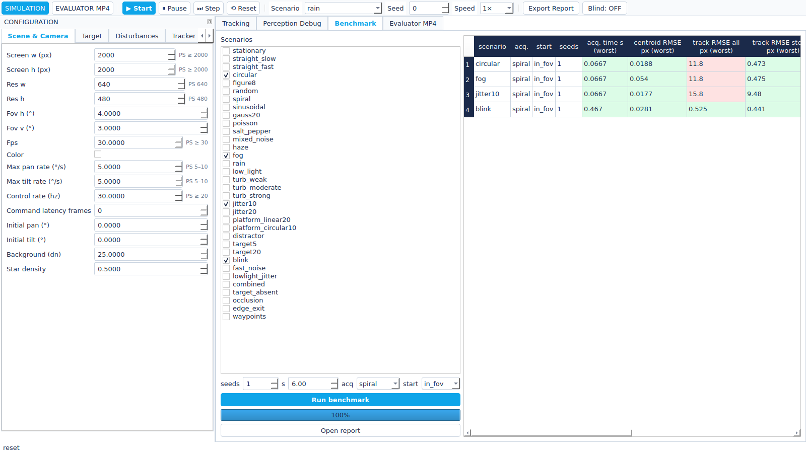

Pick scenarios, seeds, duration, acquisition mode and start mode; the benchmark runs in the
background and fills a PASS/FAIL-coloured table. *Open report* opens the combined PDF.
(This screenshot uses 6 s runs, so "track RMSE all" includes a large share of pull-in.)

## How it works

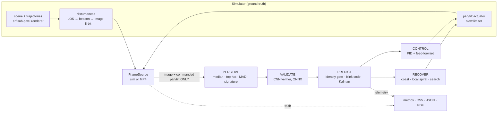

| stage | what it does |
|---|---|
| **Scene & camera** | 2000×2000 px angular screen (12.5°), pinhole 640×480 camera with a 4°×3° FOV at 30 Hz, pan/tilt limited to 5 °/s. Beacons are a box ⊗ Gaussian PSF integrated exactly over each pixel (erf), so positions are truly sub-pixel. |
| **Disturbances** | Applied in physical order: platform + jitter (line of sight) → turbulence (scintillation, angle of arrival, PSF spread) → atmosphere (haze, fog, rain, low light) → Poisson, Gaussian, salt & pepper noise → 8-bit quantisation. |
| **PERCEIVE** | 3×3 median → morphological top-hat (≈ 2.5·s + 4) → robust median + k·MAD threshold → connected components → signature score (size match × compactness × brightness) → intensity-weighted sub-pixel centroid. |
| **VALIDATE** | A 29 k-parameter CNN (ONNX Runtime, CPU) scores a 64×64 ROI around each candidate and refines the centre with a heatmap; trained only on domain-randomised simulator data. |
| **PREDICT** | Tentative tracks need 3 consistent detections (plus the blink code if enabled). A constant-velocity Kalman filter runs in the gimbal-compensated frame, so the camera's own slew cancels exactly; its noise model adapts to *measured* jitter and manoeuvres. |
| **CONTROL** | PID + velocity feed-forward with anti-windup, uncertainty-scaled gains and per-axis slew clamping. |
| **RECOVER** | Coast on the prediction (~0.33 s) → local spiral around it → global spiral search. An optional wide-FOV acquisition sensor can hand the target directly to the narrow camera. |

Full detail, equations and design decisions: [docs/TECHNICAL_REPORT.md](docs/TECHNICAL_REPORT.md)
and [docs/ARCHITECTURE.md](docs/ARCHITECTURE.md).

## Problem-statement coverage

| PS item | default | where to change it |
|---|---|---|
| Screen ≥ 2000×2000 px, 640×480 camera, FOV 4°×3°, ≥ 30 Hz, mono (colour optional) | 2000², 640×480, 4°×3°, 30 Hz, mono | Scene & Camera |
| Pan / tilt 5–10 °/s, control ≥ 20 Hz, start at screen centre | 5 °/s, 30 Hz, centre | Scene & Camera |
| 1 target (more optional), shape, size 5–20 px, random start | 1, square, 10×10, random | Target |
| Motion: straight, circular, figure-8, random (+ spiral, sinusoidal, waypoints) | circular 1 °/s | Target |
| Noise: S&P ~10 %, Gaussian σ ≤ 20, Poisson | Gaussian σ 2 + Poisson | Disturbances |
| Atmosphere: clear / haze / fog / rain / low light (+ contrast, brightness) and turbulence weak / moderate / strong | clear, none | Disturbances |
| Camera jitter ≤ ±20 px/frame; platform ≤ ±20 px/frame (linear, circular, random, spiral, figure-8) | off | Disturbances |
| Acquisition ≤ 2 s, tracking ≤ 10 px, loss < 5 %, re-acquisition ≤ 1 s, ≥ 20 FPS | — | PASS/FAIL in every report |
| Bypass the PTZ camera with an evaluator MP4 | — | Evaluator MP4 tab / `anantham video` |

## Measured results

All numbers below are generated from benchmark output by `tools/insert_results.py`;
nothing is typed by hand. Metric definitions: [docs/METRICS.md](docs/METRICS.md).

<!-- RESULTS:meta -->
Source: `results/final` — 680 runs, 5 seeds × 20 s, acquisition modes spiral, wide_fov, start modes random, in_fov, perception: config default; ablation 714 runs.
<!-- /RESULTS:meta -->

**Runs passing each PS requirement** (acquisition mode / start mode):

<!-- RESULTS:bench_headline -->
| PS requirement | spiral / in_fov | spiral / random | wide_fov / in_fov | wide_fov / random |
|---|---|---|---|---|
| Acquisition ≤ 2 s | 160/165 | 41/165 | 165/165 | 162/165 |
| Centroiding RMSE ≤ 10 px | 165/165 | 165/165 | 165/165 | 165/165 |
| Tracking RMSE (all locked) ≤ 10 px | 131/165 | 35/165 | 128/165 | 36/165 |
| Tracking RMSE (steady) ≤ 10 px | 150/165 | 149/164 | 150/165 | 150/165 |
| Target loss < 5 % | 160/165 | 160/165 | 160/165 | 160/165 |
| Re-acquisition ≤ 1 s | 10/15 | 6/11 | 10/15 | 7/12 |
| Processing ≥ 20 FPS | 170/170 | 170/170 | 170/170 | 170/170 |
| No false lock (target absent) | 5/5 | 5/5 | 5/5 | 5/5 |
| All rows pass | 131/170 | 29/170 | 131/170 | 37/170 |
<!-- /RESULTS:bench_headline -->

**Scenario matrix** — spiral acquisition, target starting inside the FOV (first page of
[`docs/results/benchmark_report.pdf`](docs/results/benchmark_report.pdf); green = meets the
PS threshold in the worst seed, red = fails):

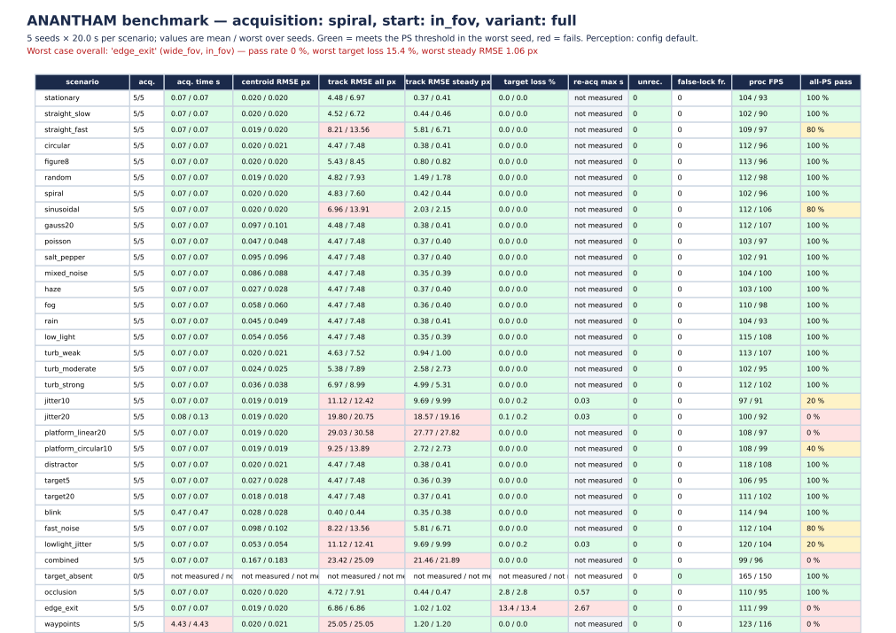

**Worst scenario groups:**

<!-- RESULTS:worst -->
| scenario | acq / start | pass rate | worst steady RMSE px | worst loss | worst acq. s |
|---|---|---|---|---|---|
| edge_exit | wide_fov / in_fov | 0 % | 1.06 | 15.38 % | 0.07 |
| edge_exit | wide_fov / random | 0 % | 1.06 | 15.38 % | 0.07 |
| edge_exit | spiral / in_fov | 0 % | 1.02 | 13.38 % | 0.07 |
| edge_exit | spiral / random | 0 % | 1.02 | 13.38 % | 0.07 |
| jitter20 | spiral / random | 0 % | 18.75 | 0.21 % | 14.43 |
| jitter20 | wide_fov / random | 0 % | 19.14 | 0.17 % | 0.47 |
| jitter20 | spiral / in_fov | 0 % | 19.16 | 0.17 % | 0.13 |
| jitter20 | wide_fov / in_fov | 0 % | 19.16 | 0.17 % | 0.13 |
<!-- /RESULTS:worst -->

**Ablation** (in-FOV start, spiral acquisition; each row adds components to the one above):

<!-- RESULTS:ablation -->
| variant | runs | acquired | centroid RMSE px | steady track RMSE px (mean/worst) | target loss (mean/worst) | re-acq events/run | re-acq max s | unrecovered runs | wrong-target frames/run | false-lock frames (target absent) | proc FPS | all-PS pass |
|---|---|---|---|---|---|---|---|---|---|---|---|---|
| classical_only | 102 | 100% | 140.282 | 28.86 / 958.75 | 25.05% / 100.00% | 15.6 | 7.37 | 18 | 40.4 | 275.0 | 134 | 2% |
| classical_kalman | 102 | 100% | 182.322 | 53.72 / 964.20 | 27.00% / 100.00% | 25.5 | 1.37 | 17 | 49.4 | 409.0 | 152 | 2% |
| cnn_only | 102 | 100% | 195.886 | 10.57 / 27.97 | 28.86% / 99.83% | 17.9 | 2.97 | 33 | 15.4 | 65.7 | 10 | 0% |
| hybrid | 102 | 100% | 33.927 | 10.54 / 28.12 | 21.70% / 100.00% | 14.5 | 6.87 | 24 | 1.1 | 16.0 | 112 | 2% |
| hybrid_gate | 102 | 100% | 0.040 | 10.53 / 28.10 | 18.11% / 97.32% | 11.7 | 6.93 | 20 | 0.0 | 0.0 | 136 | 29% |
| hybrid_gate_ff | 102 | 100% | 0.040 | 4.87 / 38.51 | 1.51% / 31.44% | 1.0 | 2.67 | 2 | 0.0 | 0.0 | 136 | 76% |
| full | 102 | 100% | 0.040 | 3.74 / 27.82 | 0.49% / 13.38% | 0.1 | 2.67 | 0 | 0.0 | 0.0 | 129 | 76% |
<!-- /RESULTS:ablation -->

**CNN verifier** (held-out simulated ROIs):

<!-- RESULTS:cnn -->
| item | value |
|---|---|
| training samples (simulated ROIs) | 60000 (10 % held out) |
| epochs / seed | 12 / 0 |
| parameters | 28948 |
| validation accuracy | 96.53 % |
| precision / recall | 97.87 % / 97.23 % |
| false-positive rate | 5.18 % |
| heatmap localisation error median / P95 | 0.348 / 26.368 px |
| training time (CPU) | 32.1 min |
<!-- /RESULTS:cnn -->

### Honest reading of the numbers

* **Acquisition.** With a single 4°×3° camera and a *random* start anywhere on the 12.5°
  screen, the 2 s requirement is **not** met: the spiral needs up to 14.1 s (analytic) at
  5 °/s. It is met when the target starts inside the FOV, and with the OPTIONAL wide-FOV
  acquisition sensor.
* **Tracking error** is reported for *all locked frames* (includes the post-lock pull-in of
  a slew-limited gimbal) and for the *steady state* (≥ 1 s after the latest lock).
* **Jitter and platform.** ±10 / ±20 px/frame white jitter sets a floor of J·√(2/3) px RMS
  (8.2 / 16.3 px); the ±20 px/frame linear platform is limited by slew physics (the gimbal
  can close the gap at only ~6.7 px/frame after each reversal). Lock is kept in both.
* **Edge exit** counts the ~2.6 s the target is physically off-screen as loss, by definition.

## What every run writes

| file | content |
|---|---|
| `<name>_report.pdf` | PS PASS/FAIL table, metrics, full configuration, error histograms, error vs time, state timeline, processing FPS, pan/tilt rates, seed |
| `<name>_summary.json` | every metric and PASS/FAIL row |
| `<name>_frames.csv` | per-frame state, measurement, prediction, truth, errors, pan/tilt (deterministic) |
| `<name>_timing.csv` | per-frame processing and render time |
| `<name>_centroids.csv` | evaluator format `frame,time_s,x_px,y_px,state,confidence` |
| `<name>_config.yaml` | the exact configuration and seed (re-run with `--preset <file>`) |
| `<name>.log` | px↔angle conversion, kernel sizes, analytic worst-case search time, state transitions |

<table>
<tr>
<td width="50%">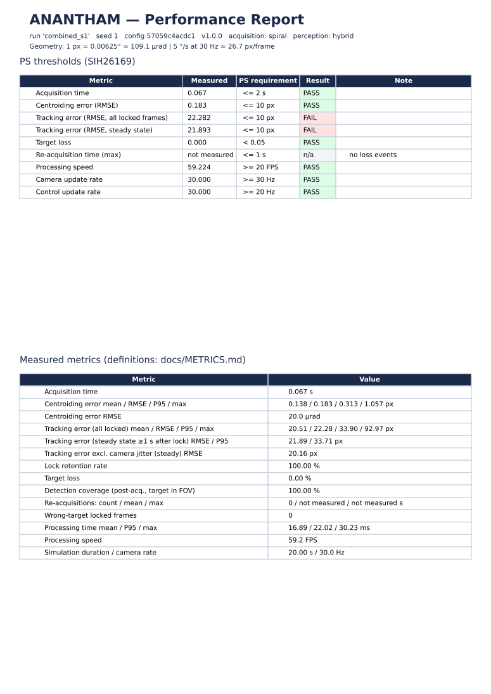<br/><sub>Report page 1 — PS PASS/FAIL table and measured metrics (scenario <i>combined</i>).</sub></td>
<td width="50%">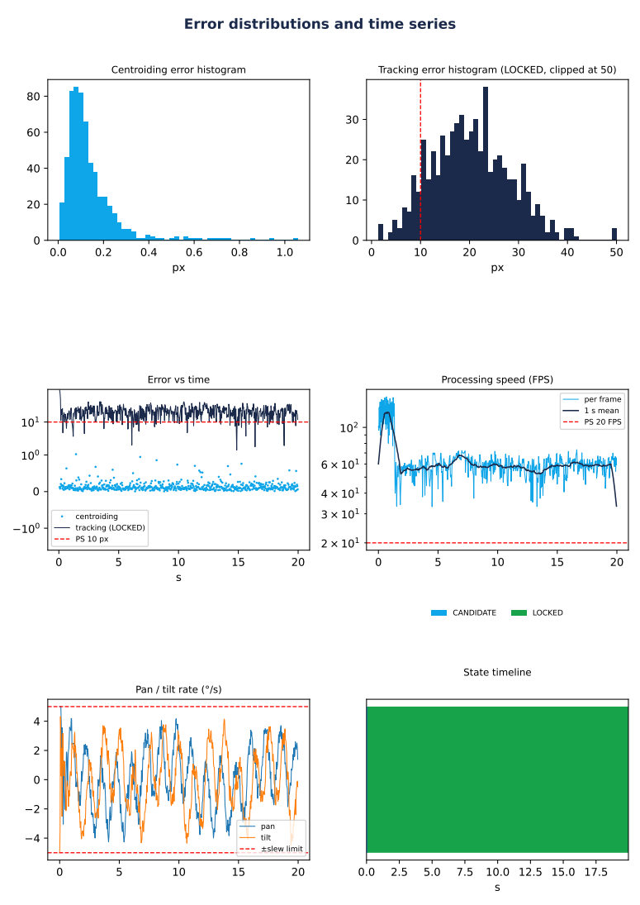<br/><sub>Report plots — error histograms, error vs time, processing FPS, pan/tilt rates, state timeline.</sub></td>
</tr>
</table>

## Repository layout and development

```
anantham/
  config/      schema with PS ranges + validation, YAML presets (default + 34 scenarios)
  sim/         scene & renderer, trajectories, disturbances, pan/tilt actuator   (ground truth)
  io/          FrameSource: simulator and MP4
  perception/  classical detector, CNN verifier (ONNX), adaptive spot scale
  tracking/    Kalman filter, identity gate & blink code, state machine
  control/     PID + feed-forward controller, spiral search, wide-FOV hand-off
  pipeline/    PatSystem (one PAT iteration), Session (main loop, sensor boundary)
  metrics/     per-frame logger, PS metrics + PASS/FAIL, PDF reports
  bench/       scenarios, parallel benchmark runner, ablation
  gui/         PyQt6 console (loop runs in its own process)
  training/    dataset, training, ONNX export
  models/      verifier.onnx + model card
tools/         make_test_video · insert_results · make_screenshots · anantham_entry (PyInstaller)
tests/         56 unit + integration tests
docs/          user manual · technical report · architecture · metrics · demo script · results
```

```bash
pip install -r requirements.txt && pip install -e .
ruff check anantham tests tools && pytest -q                      # lint + tests
anantham train --samples 60000 --epochs 12                         # retrain the CNN (needs torch, onnx)
pyinstaller anantham.spec --noconfirm                              # one-folder build → dist/ANANTHAM/
QT_QPA_PLATFORM=offscreen python tools/make_screenshots.py docs/img   # regenerate screenshots
python tools/insert_results.py results/final                      # refresh result tables
```

CI (GitHub Actions) runs lint, tests and a 10-second smoke benchmark on Ubuntu and Windows
for every push; the Windows executable is built on `v*` tags or a manual *Run workflow*.

## Documentation

| document | for |
|---|---|
| [User manual](docs/USER_MANUAL.md) | installation, every GUI control, parameter reference with PS ranges, MP4 workflow, troubleshooting |
| [Technical report](docs/TECHNICAL_REPORT.md) | models, algorithms, test methodology, results, ablation, failure analysis, limitations |
| [Architecture](docs/ARCHITECTURE.md) | module map, sensor boundary, state machine |
| [Metrics](docs/METRICS.md) | exact metric definitions and PS thresholds |
| [Recording guide](docs/RECORDING_GUIDE.md) | click-by-click screen-recording walkthrough (prep commands, 11 scenes, narration, YouTube template) |
| [Demo script](docs/DEMO_SCRIPT.md) | 4-minute demo walkthrough |

---

<sub>License: MIT · Built for Smart India Hackathon 2026, problem statement SIH26169.</sub>
