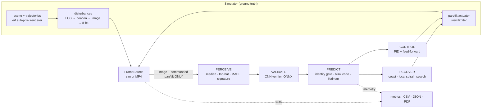

# ANANTHAM — FSOC Coarse Alignment Console

**AI-based virtual camera tracking for coarse alignment of mobile Free Space Optical
Communication terminals** · Smart India Hackathon 2026 · SIH26169 (ISRO / Space Applications Centre)

Anantham is a software laboratory for the coarse stage of Pointing, Acquisition and
Tracking (PAT) in mobile FSOC links. It generates a configurable virtual scene with one or
more moving optical beacons, renders the view of a rate-limited virtual pan-tilt camera,
injects realistic disturbances (atmospheric turbulence, haze, fog, rain, low light,
salt & pepper / Gaussian / Poisson noise, camera jitter, platform vibration), and runs a
closed loop: PERCEIVE → VALIDATE → PREDICT → CONTROL → RECOVER. It detects and identifies
the designated beacon, estimates its position and velocity, keeps it centred within
actuator limits, recovers after loss, and logs every performance metric the PS requires.
In Evaluator MP4 mode it bypasses the PTZ camera and runs the same perception and tracking
stack on external video.


## Quick start

```bash
pip install -r requirements.txt && pip install -e .
anantham gui                                                   # the console
anantham run --preset circular --seed 3 --duration 20 --out results/
anantham make-video --preset fog --out test.mp4                # synthetic MP4 + truth CSV
anantham video --input test.mp4 --truth test_truth.csv --out results/
anantham bench --scenarios all --seeds 5 --acq both --start both --out results/bench [--ablation]
```

Windows: download the `ANANTHAM-windows` artefact from CI (built on tags with
`pyinstaller anantham.spec`) and run `ANANTHAM.exe` — no Python needed.
Full instructions: [docs/USER_MANUAL.md](docs/USER_MANUAL.md).

## Architecture



Ground truth never reaches perception, tracking or control — enforced by
`tests/test_boundary.py`. Details: [docs/ARCHITECTURE.md](docs/ARCHITECTURE.md),
[docs/TECHNICAL_REPORT.md](docs/TECHNICAL_REPORT.md), metric definitions:
[docs/METRICS.md](docs/METRICS.md).

## Measured results

All numbers below are generated from benchmark output by `tools/insert_results.py`;
nothing is typed by hand.

<!-- RESULTS:meta -->
Source: `results/final` — 680 runs, 5 seeds × 20 s, acquisition modes spiral, wide_fov, start modes random, in_fov, perception: config default; ablation 714 runs.
<!-- /RESULTS:meta -->

Runs passing each PS requirement (acquisition mode / start mode):

<!-- RESULTS:bench_headline -->
| PS requirement | spiral / in_fov | spiral / random | wide_fov / in_fov | wide_fov / random |
|---|---|---|---|---|
| Acquisition ≤ 2 s | 160/165 | 41/165 | 165/165 | 162/165 |
| Centroiding RMSE ≤ 10 px | 165/165 | 165/165 | 165/165 | 165/165 |
| Tracking RMSE (all locked) ≤ 10 px | 131/165 | 35/165 | 128/165 | 36/165 |
| Tracking RMSE (steady) ≤ 10 px | 150/165 | 149/164 | 150/165 | 150/165 |
| Target loss < 5 % | 160/165 | 160/165 | 160/165 | 160/165 |
| Re-acquisition ≤ 1 s | 10/15 | 6/11 | 10/15 | 7/12 |
| Processing ≥ 20 FPS | 170/170 | 170/170 | 170/170 | 170/170 |
| No false lock (target absent) | 5/5 | 5/5 | 5/5 | 5/5 |
| All rows pass | 131/170 | 29/170 | 131/170 | 37/170 |
<!-- /RESULTS:bench_headline -->

Worst scenario groups:

<!-- RESULTS:worst -->
| scenario | acq / start | pass rate | worst steady RMSE px | worst loss | worst acq. s |
|---|---|---|---|---|---|
| edge_exit | wide_fov / in_fov | 0 % | 1.06 | 15.38 % | 0.07 |
| edge_exit | wide_fov / random | 0 % | 1.06 | 15.38 % | 0.07 |
| edge_exit | spiral / in_fov | 0 % | 1.02 | 13.38 % | 0.07 |
| edge_exit | spiral / random | 0 % | 1.02 | 13.38 % | 0.07 |
| jitter20 | spiral / random | 0 % | 18.75 | 0.21 % | 14.43 |
| jitter20 | wide_fov / random | 0 % | 19.14 | 0.17 % | 0.47 |
| jitter20 | spiral / in_fov | 0 % | 19.16 | 0.17 % | 0.13 |
| jitter20 | wide_fov / in_fov | 0 % | 19.16 | 0.17 % | 0.13 |
<!-- /RESULTS:worst -->

Ablation (in-FOV start, spiral acquisition):

<!-- RESULTS:ablation -->
| variant | runs | acquired | centroid RMSE px | steady track RMSE px (mean/worst) | target loss (mean/worst) | re-acq events/run | re-acq max s | unrecovered runs | wrong-target frames/run | false-lock frames (target absent) | proc FPS | all-PS pass |
|---|---|---|---|---|---|---|---|---|---|---|---|---|
| classical_only | 102 | 100% | 140.282 | 28.86 / 958.75 | 25.05% / 100.00% | 15.6 | 7.37 | 18 | 40.4 | 275.0 | 134 | 2% |
| classical_kalman | 102 | 100% | 182.322 | 53.72 / 964.20 | 27.00% / 100.00% | 25.5 | 1.37 | 17 | 49.4 | 409.0 | 152 | 2% |
| cnn_only | 102 | 100% | 195.886 | 10.57 / 27.97 | 28.86% / 99.83% | 17.9 | 2.97 | 33 | 15.4 | 65.7 | 10 | 0% |
| hybrid | 102 | 100% | 33.927 | 10.54 / 28.12 | 21.70% / 100.00% | 14.5 | 6.87 | 24 | 1.1 | 16.0 | 112 | 2% |
| hybrid_gate | 102 | 100% | 0.040 | 10.53 / 28.10 | 18.11% / 97.32% | 11.7 | 6.93 | 20 | 0.0 | 0.0 | 136 | 29% |
| hybrid_gate_ff | 102 | 100% | 0.040 | 4.87 / 38.51 | 1.51% / 31.44% | 1.0 | 2.67 | 2 | 0.0 | 0.0 | 136 | 76% |
| full | 102 | 100% | 0.040 | 3.74 / 27.82 | 0.49% / 13.38% | 0.1 | 2.67 | 0 | 0.0 | 0.0 | 129 | 76% |
<!-- /RESULTS:ablation -->

CNN verifier (held-out simulated ROIs):

<!-- RESULTS:cnn -->
| item | value |
|---|---|
| training samples (simulated ROIs) | 60000 (10 % held out) |
| epochs / seed | 12 / 0 |
| parameters | 28948 |
| validation accuracy | 96.53 % |
| precision / recall | 97.87 % / 97.23 % |
| false-positive rate | 5.18 % |
| heatmap localisation error median / P95 | 0.348 / 26.368 px |
| training time (CPU) | 32.1 min |
<!-- /RESULTS:cnn -->

### Honest reading of the numbers

* With a single 4°×3° camera and a **random** start anywhere on the 12.5° screen, the
  2 s acquisition requirement is **not** met: the spiral search needs up to 14.1 s
  (analytic) at 5 °/s. It is met when the target starts inside the FOV, and with the
  OPTIONAL wide-FOV acquisition sensor.
* Tracking error is reported for *all locked frames* (includes the post-lock pull-in) and
  for the *steady state*; the first is often above 10 px because the gimbal is slew-limited.
* ±10/±20 px/frame white camera jitter sets a floor of J·√(2/3) px RMS on pointing error;
  the ±20 px/frame linear platform is limited by slew physics. See the failure analysis in
  the technical report.

## Repository layout

```
anantham/  config/ sim/ perception/ tracking/ control/ io/ metrics/ bench/ gui/ training/ pipeline/ models/
tools/     make_test_video.py  insert_results.py  anantham_entry.py
tests/     unit + integration tests (pytest)
docs/      USER_MANUAL · TECHNICAL_REPORT · ARCHITECTURE · METRICS · DEMO_SCRIPT
```

## Development

```bash
pip install -r requirements.txt && pip install -e .
ruff check anantham tests tools && pytest -q
anantham train --samples 60000 --epochs 12      # retrain the CNN (needs torch, onnx)
pyinstaller anantham.spec --noconfirm           # one-folder build → dist/ANANTHAM/
```

License: MIT.
