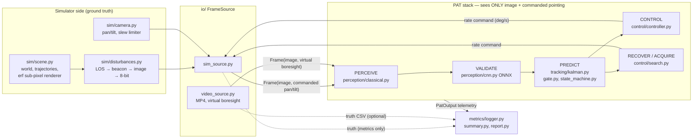
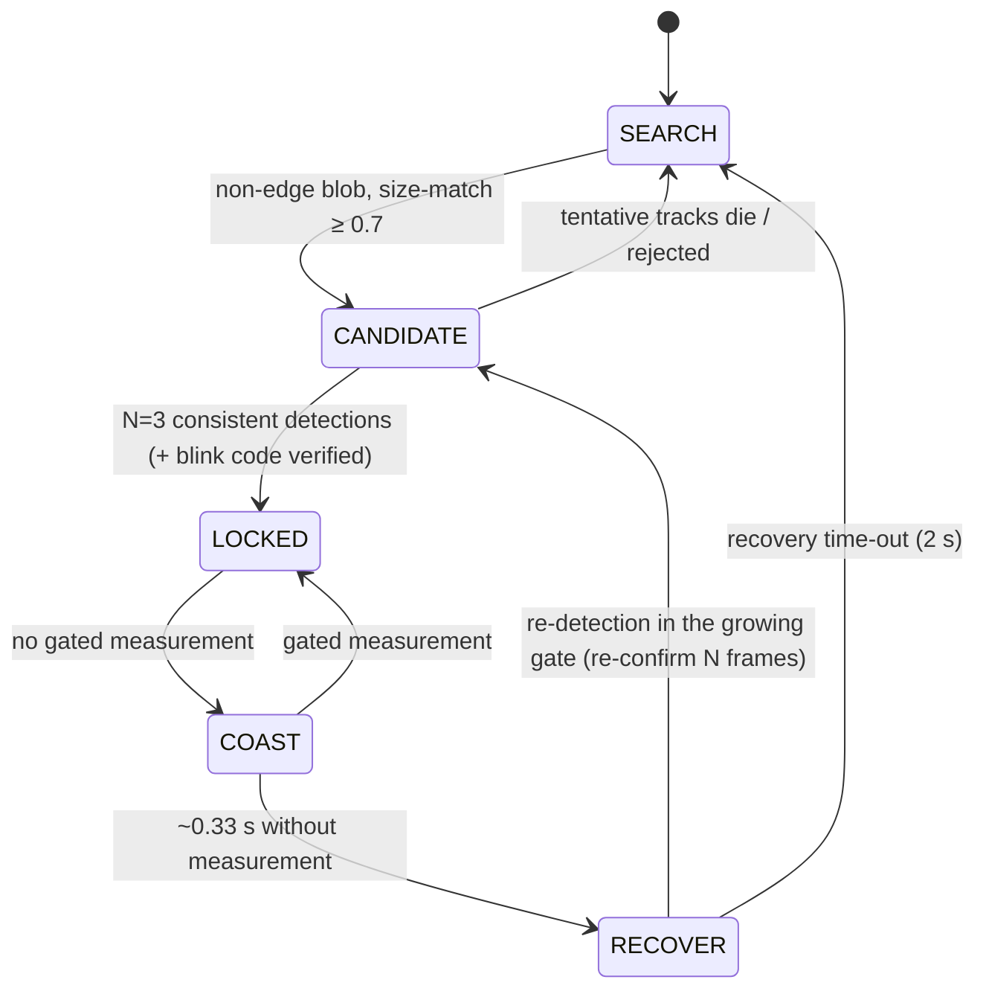

# ANANTHAM — Architecture

## Closed loop and the sensor boundary

The boundary is enforced in three ways:

1. `pipeline/session.py` is the only module that touches both sides; the boundary is marked
   with a banner comment in `Session.step`.
2. `tests/test_boundary.py` parses every module in `perception/`, `tracking/`, `control/`,
   `pipeline/pat.py`, `io/base.py`, `geometry.py` and fails on any import of `anantham.sim`,
   `anantham.metrics`, `anantham.bench`, `anantham.io.sim_source` or `anantham.pipeline.session`.
3. The same test imports the PAT packages in a fresh interpreter and checks that no
   forbidden module was loaded transitively.

What the PAT stack is allowed to know: the image(s), the commanded pan/tilt, and published
sensor / designation specifications from the config (FOV, resolution, frame rate, slew
limits, the designated beacon's nominal size and blink code). Jitter magnitude is **not**
given to the tracker — it is measured online from second differences of the measurements.

## Packages

| package | role |
|---|---|
| `config/` | dataclass schema with PS ranges as metadata, validation, YAML presets |
| `geometry.py` | pinhole camera model, px ↔ angle, rate conversions |
| `sim/` | trajectories (8 motion types), scene & renderer, disturbances, pan/tilt actuator |
| `io/` | `FrameSource` interface: `SimSource` (closed loop), `VideoSource` (MP4, virtual boresight) |
| `perception/` | classical detector, CNN verifier (ONNX Runtime), adaptive spot scale |
| `tracking/` | constant-velocity Kalman (+ noise estimator, IMM stub), identity gate & blink code, state machine |
| `control/` | PID + feed-forward controller, square-spiral search, wide-FOV hand-off |
| `pipeline/` | `PatSystem` (one PAT iteration), `Session` (main loop, boundary, outputs) |
| `metrics/` | per-frame logger, PS metric summary + PASS/FAIL, PDF / text reports |
| `bench/` | scenario table, parallel benchmark runner, ablation |
| `training/` | domain-randomised dataset, PyTorch training, ONNX export |
| `gui/` | PyQt6 console, QThread worker, widgets |

## State machine

## Data products per run

`<name>_frames.csv` (deterministic), `<name>_timing.csv`, `<name>_centroids.csv`
(`frame,time_s,x_px,y_px,state,confidence`), `<name>_summary.json`, `<name>_config.yaml`
(config + seed), `<name>.log` (geometry line, PAT facts, state transitions),
`<name>_report.pdf`.
